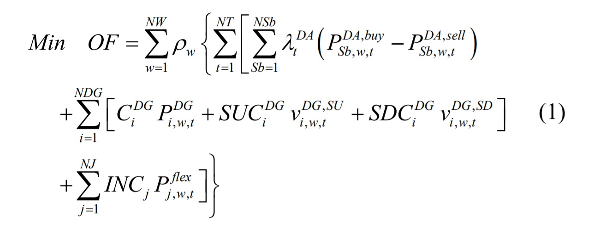
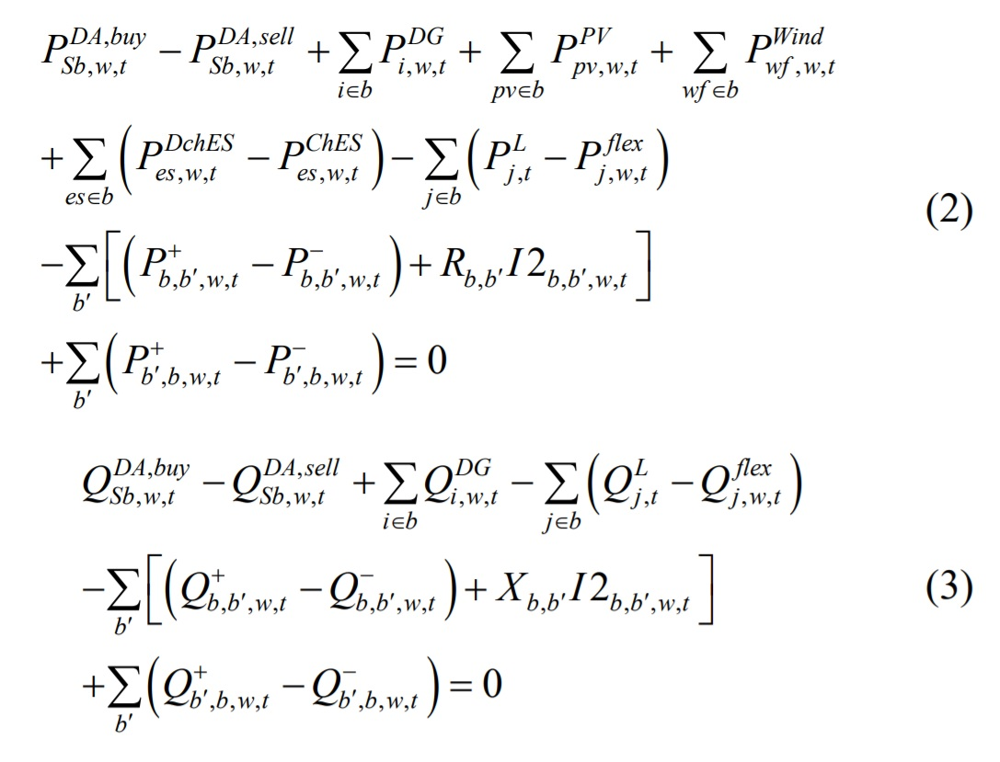
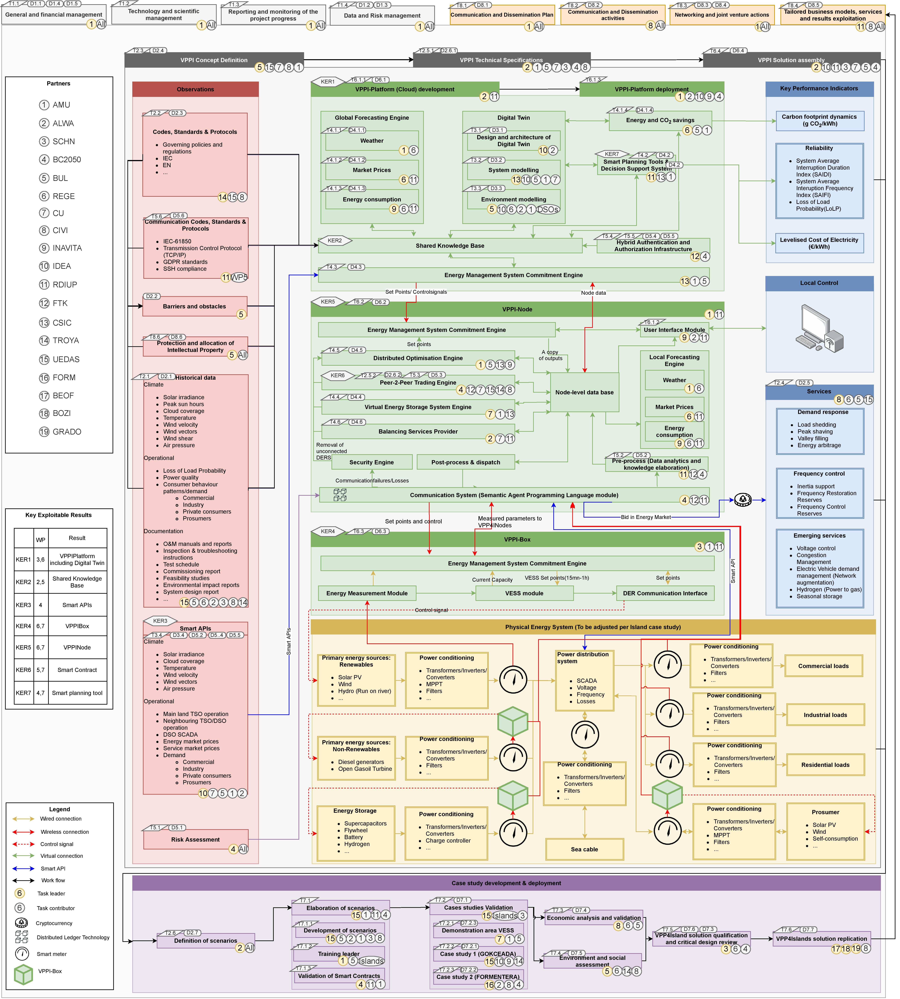

# VPP4ISLANDS
In this project the graph representation of the one-line model of a smart grid in an island is presented.
For optimizing the performance of the virtual powerplant corresponding to the graph,
regarding the benefits of prosumers and with the aim of reducing CO2 emission,
an optimization module will be provided.

## run and test:
### make sure you have Gurobi currectly installed by running:
```
python -m "tests.test_dep.Gurobi Optimizer.test0"
```
### test basic graph features
```
python -m unittest tests.test1
python -m tests.VPP.test_15bus
```
### test Vpp::VppInterface
```
python -m tests.VPP.test_VppInterface
```
### test Vpp::Optimizer
```
python -m tests.VPP.test_Optimizer
```

## minimize function:


## subject to:


---

## Taxonomy:

